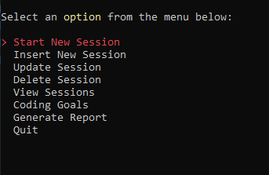
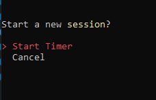
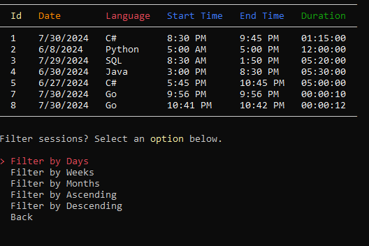
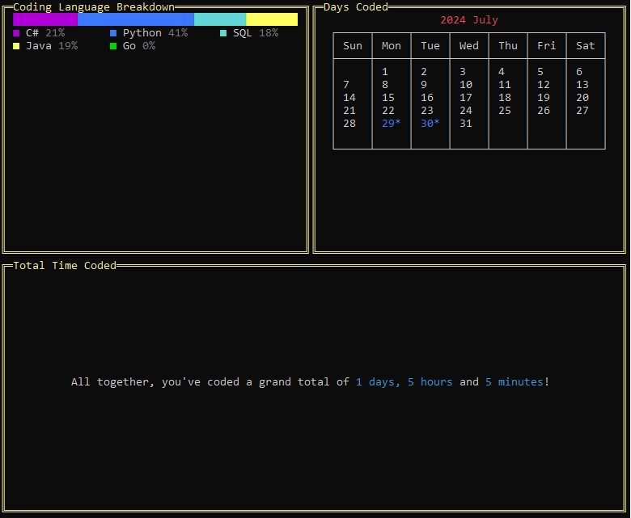
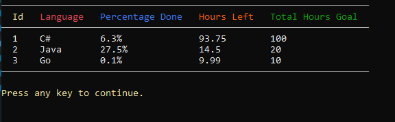

# CodingTracker
CRUD Based Console Application to log Coding Sessions.
Developed using C# and SQLite.

# Requirements
- [x] This application has the same requirements as the [previous project](https://thecsharpacademy.com/project/12/habit-logger), except that now you'll be logging your daily coding time.
- [x] To show the data on the console, you should use the "Spectre.Console" library. 
- [x] You're required to have separate classes in different files (ex. UserInput.cs, Validation.cs, CodingController.cs) 
- [x] You should tell the user the specific format you want the date and time to be logged and not allow any other format. 
- [x] You'll need to create a configuration file that you'll contain your database path and connection strings. 
- [x] You'll need to create a "CodingSession" class in a separate file. It will contain the properties of your coding session: Id, StartTime, EndTime, Duration 
- [x] The user shouldn't input the duration of the session. It should be calculated based on the Start and End times, in a separate "CalculateDuration" method.
- [x] The user should be able to input the start and end times manually. 
- [x] You need to use Dapper ORM for the data access instead of ADO.NET. (This requirement was included in Feb/2024) 
- [x] When reading from the database, you can't use an anonymous object, you have to read your table into a List of Coding Sessions. 

# Features
- Managed with a SqLite database
- Navigate through application with key presses
  - 
- CRUD DB functions that allow users to:
  - Track sessions with in-app timer
    - 
  - Insert, delete, update and sort coding sessions
    - 
- Show users a breakdown of their coding sessions
  - 
- Create coding goals and allow users to track progress
  - 

# Challenges
- Project organization. I tried to do all the optional challenges and the app got surprisingly large at times. I found myself regulary restructuring and reorganizing to make it easier to navigate. This on top of trying to learn about and design everything according to MVC made this a real struggle for me.
- Implementing new tools in the project (Dapper and Spectre Console)
- Creating the xml file for configuration
- Had to start learning about asynchronous programming in order to implement the timer.
- Had to change the date format in the db to yyyy/MM/dd. Couldn't get sorting by months to work otherwise. There was quite a lot of parsing and string formatting happening with dates in this project.
- Dealing with the math involving the coding goal status had some issues that I didn't completely figure out. There was also quite a bit of formatting when it came to the numbers displayed and I tried my best to make sure it was accurate but am not confident that I succeeded.
- Like last project, I struggled with where to implement exceptions and validation. I used Spectre for the menus and I wasn't sure how to validate those other than to just check if the choices selected were null.