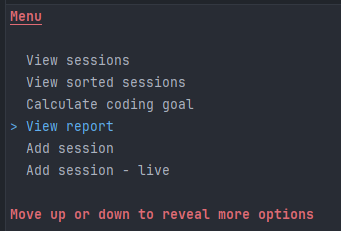
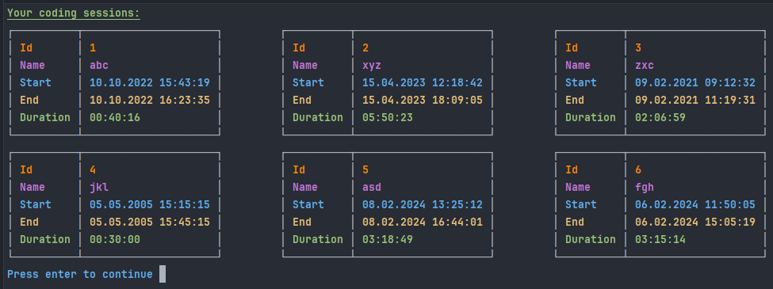
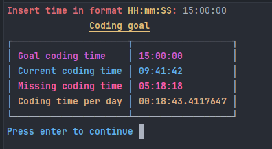
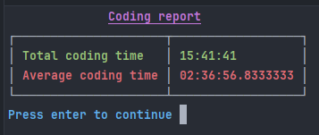

# Coding tracker

## Table of contents
- [About](#about)
- [Features](#features)

## About
CRUD application designed to track and manage your coding sessions.
You can also generate reports and calculate your coding goals.

## Features
- Program connects to sqlite database. If you want to restore
  data copy `database-copy.db` to project folder and rename it to `database.db`

- Console based UI where user can view, create, update and delete coding sessions

- Generating reports and setting coding goals

