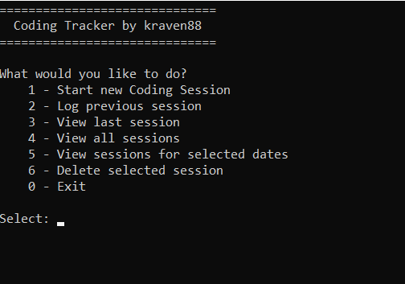
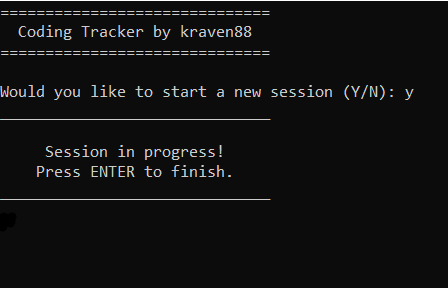
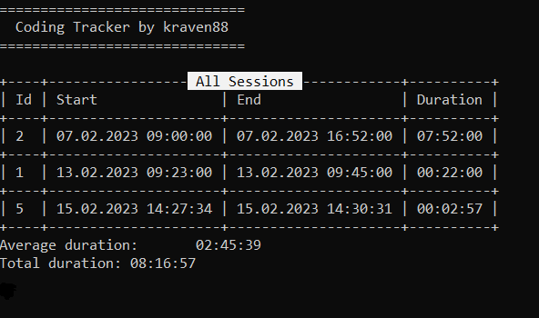

# Console Coding Tracker  
This is the Console Coding Tracker app, created for [The C# Academy](https://www.thecsharpacademy.com/#), based on the requirements listed in the project.
The purpose of this app, is to manage complexity of implementing and handling Date and Time. Also, the app is using external library to handle data display.

## Requirements  
- [x] This application has the same requirements as the previous project, except that now you'll be logging your daily coding time.
- [x] To show the data on the console, you should use the "ConsoleTableExt" library.
- [x] You 're required to have separate classes in different files (ex. UserInput.cs, Validation.cs, CodingController.cs)
- [x] You should tell the user the specific format you want the date and time to be logged and not allow any other format.
- [x] You 'll need to create a configuration file that you'll contain your database path and connection strings.
- [x] You 'll need to create a "CodingSession" class in a separate file. It will contain the properties of your coding session: Id, StartTime, EndTime, Duration
- [x] The user shouldn't input the duration of the session. It should be calculated based on the Start and End times, in a separate "CalculateDuration" method.
- [x] The user should be able to input the start and end times manually.
- [x] When reading from the database, you can't use an anonymous object, you have to read your table into a List of Coding Sessions.

## CHALLENGE: 
- [x] Add the possibility of tracking the coding time via a stopwatch so the user can track the session as it happens.
- [x] Let the users filter their coding records per period (weeks, days, years) and/or order ascending or descending.
- [x] Create reports where the users can see their total and average coding session per period.

## App Overview  
 
- The App comes with a self-contain database, which is created on first startup. It is a single file, named "CodingTrackerDB" and can be copied and shared among users. If the database will become corrupted (or deleted) a new one will be created when the app is launched.
- The app is designed for personal use and handles only coding sessions 
 
    
    
- The app allows for tracking coding session as they happen. Users can also log previous sessions, by specifying start and end date and time.

    

- The app allows for creating and viewing previous sessions in variety of ways.
- List view is provided for last session, all sessions and sessions from selected time period. When more than 1 session is displayed, users can also see average and total coding time
    
    

- Coding Tracker allows for deleting a selected session, if required.

## Technology Used  

- Habit Logger is powered by .NET 7
- All coding done via Visual Studio 2022
- SQlite Database is handled by System.Data.Sqlite.Core libraries. No Object Relation Mappers (ORM) were used.
- DB Browser for SQLite to test SQL statements and how they affect the database.
- The "ConsoleTableExt" library is used for managing the view of the coding sessions list.

## Challenges  

- Since this app is mostly an evolution of the HabitLogger, most of its elements have already been "hadled", so I only had to apply those solutions to fit this app.
- While easy and fast to implement, Console UI is very utilitarian and not very User friendly.

## Lessons Learned  

- DateTime objects are tricky on their own, but parsing them from the text in the Console App is oboxious. In the future, if the app requires user to enter a date/time, a different UI should be used for cleaner, more elegant and readable user experience.

## Resources used

- Pablo and the entire [C# Academy](https://www.thecsharpacademy.com/#) community
- [Tim Corey C# Masterclass](https://courses.iamtimcorey.com/) and his [YouTube channel](https://www.youtube.com/@IAmTimCorey)
- [W3Schools](https://www.w3schools.com/) to brush up my SQL
- [MS Learn](https://learn.microsoft.com/en-us/) and the ADO.NET documentation
- [DB Browser for SQLite](https://sqlitebrowser.org/)
- [ConsoleTableExt](https://github.com/minhhungit/ConsoleTableExt) documentation
- google, stack and reddit