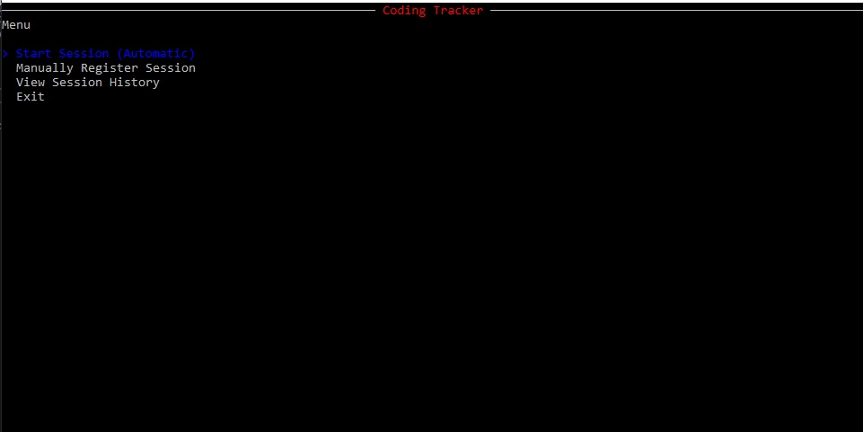

# CodingTracker Challenge Project

This Console application allows users to log and record time spent programming.

## Usage

When you open the application you are presented with a menu:

Register New session allows you to record a session without having to
enter the start date and end date manually and calculates the duration
automatically.

Manual adding a new session requires you to input the dates and times
manually using the format - DD/MM/YYYY HH:MM Be aware that the time
is 24 Hours.

View History allows you to see your previous session with start dates,
end dates and the calculated duration in minutes.

## NuGet Packages Used

- SQLite
- Dapper Micro ORM
- Spectre.Console
- System.Data.SQLite
